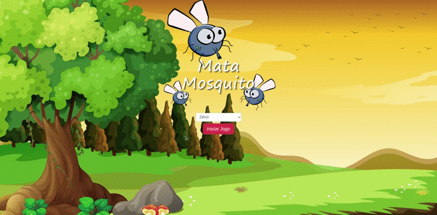

# mataMosquito
Um jogo simples feito apenas com JavaScript onde ficará aparecendo mosquitos na tela e o objeto é o jogador dar um click
sobre o mosquito.

* Cada dificudade tem um tempo para o mosquito desaparecer.
* Se o mosquito desaparecer sem se o jogador ter clicado
nele tirará uma vida do jogador.
* O jogador começa com três vidas
* Cada dificuldade tem um tempo
* Se o tempo for alcançado sem perder todas as
vidas o jogador vence.

